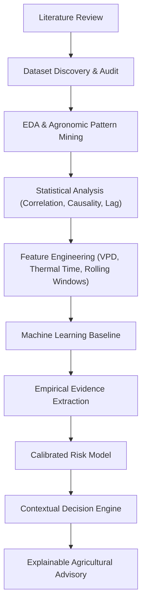

# TaniAdapt — Hyperlocal Precision Agro-Advisory

> **Evidence-Based Agricultural Decision Support System for Indonesian Smallholders**  
> *Translating Microclimate, Phenology, and Agrometeorological Dynamics into Calibrated Agronomic Actions.*

---

## 📌 Executive Summary

**TaniAdapt** adalah riset dan pengembangan sistem pendukung keputusan (*decision-support system*) presisi hiperlokal untuk sektor pertanian di Indonesia. Berbeda dengan pendekatan konvensional yang kerap mengandalkan aturan ambang batas naif (*naive rule-based threshold*, misal: `rainfall > X mm → bahaya`), TaniAdapt mengusung metodologi **evidence-based machine learning & statistical modeling** yang mengintegrasikan literatur agrometeorologi, dinamika mikroklimat temporal, serta fenologi tanaman.

### Paradigma Rekomendasi
```text
[ Mikroklimat & Temporal ] + [ Crop & Growth Stage ] + [ Variabel Biofisik ]
                                   ↓
                            Risk Assessment
                                   ↓
                           Recommended Action
                                   ↓
                         Agronomic Explanation
```

---

## 🔬 Metodologi: Evidence-Based Pipeline

TaniAdapt dibangun melalui alur ilmiah yang ketat dari pembuktian data hingga ke mesin rekomendasi:



---

## 📊 Dimensi Data & Fitur

Sistem ini dirancang untuk memproses multivariat data berikut:

| Kategori | Fitur / Variabel |
|---|---|
| **Weather / Microclimate** | Temperatur udara ($T_{min}$, $T_{max}$, $T_{avg}$), Curah hujan / intensitas presipitasi, Kelembapan relatif (RH), Radiasi matahari, Kecepatan & arah angin |
| **Temporal Dynamics** | Weather history, lag features (1–14 hari), rolling window statistics (mean, sum, std, consecutive wet/dry days) |
| **Crop Biology** | Jenis tanaman, varietas, koefisien tanaman ($K_c$) |
| **Phenology** | Fase pertumbuhan (*growth stage*), akumulasi satuan panas / Growing Degree Days (GDD) |
| **Biophysical / Agrometeorological** | Kelembapan tanah (*soil moisture*), Vapor Pressure Deficit (VPD), Evapotranspirasi (ET₀/ETc), *Leaf Wetness Duration* (LWD) |
| **Target Outcome (TBD)** | *Crop Disease Incidence / Severity* ATAU *Yield Prediction / Loss Risk* *(diputuskan pada Phase 5)* |

---

## 🗺️ Research Roadmap & Current Status

Proyek saat ini berada di **PHASE 3 (Dataset Discovery)**:

- [x] **PHASE 0** — Definisi Masalah & Kebutuhan Agro-Advisory Hiperlokal
- [x] **PHASE 1** — Research Questions (RQ) & Perumusan Hipotesis
- [x] **PHASE 2** — Deep Literature Review (Epidemiologi Penyakit & Agroklimatologi)
- [🔄] **PHASE 3 — Dataset Discovery** *(← SEDANG BERJALAN)*
  - Mengumpulkan kandidat open-access & benchmark agrikultur.
  - Penjajakan akses dataset khusus (e.g., IND-TAFD request ke author).
  - Konsultasi kandidat dataset bersama dosen pembimbing & jejaring Fakultas Pertanian untuk potensi data lokal/mikro.
- [ ] **PHASE 4** — Dataset Quality Audit (Kelengkapan temporal, noise, missingness, sensor drift)
- [ ] **PHASE 5** — Crop + Outcome Selection (Finalisasi komoditas & fokus: Disease vs. Yield)
- [ ] **PHASE 6** — Exploratory Data Analysis (EDA) & Domain Verification
- [ ] **PHASE 7** — Statistical Analysis (Lag correlation, non-linear dependencies)
- [ ] **PHASE 8** — Domain-Informed Feature Engineering (VPD, GDD, cumulative indices)
- [ ] **PHASE 9** — ML Baseline & Evaluation Framework
- [ ] **PHASE 10** — Evidence Extraction → Calibrated Risk Model
- [ ] **PHASE 11** — Risk Model → Decision Engine Architecture
- [ ] **PHASE 12** — Agronomic & Empirical Validation
- [ ] **PHASE 13** — TaniAdapt Decision-Support Application Deployment

> **Catatan Fase 3:**  
> Pilihan dataset final, jenis komoditas tanaman, serta target spesifik (*disease risk* vs *yield outcome*) sengaja **belum dikunci**. Kandidat dataset saat ini sedang dihimpun sebagai bahan diskusi akademik dan eksplorasi kolaborasi dengan Fakultas Pertanian untuk mendapatkan data lokal Indonesia yang paling granular dan relevan.

---

## 📂 Struktur Repositori

```text
research_taniAdapt/
├── README.md               # Dokumentasi utama proyek & status riset
├── data/                   # Ruang kerja kandidat dataset (raw & staging)
│   ├── data_1/             # Kandidat dataset 1
│   ├── data_2/             # Kandidat dataset 2
│   ├── data_3/             # Kandidat dataset 3
│   ├── data_4/             # Kandidat dataset 4
│   └── data_5/             # Kandidat dataset 5 (e.g. tracking IND-TAFD / lokal)
└── notebook/               # Notebooks eksplorasi kandidat dataset & literatur
    ├── 01_agridatavalue.ipynb
    ├── 02_hzrsi.ipynb
    ├── 03_rice_weather_yield.ipynb
    └── 04_plant_disease_weather.ipynb
```

---

## 🎯 Target Akhir Sistem

1. **Precision Risk Scoring:** Penilaian probabilitas risiko berbasis model empiris, bukan aturan kaku statis.
2. **Context-Aware Advisory:** Rekomendasi aksi agronomi (irigasi adaptif, aplikasi preventif, penyesuaian jadwal tanam/panen) disesuaikan dengan fase fenologi tanaman.
3. **Interpretability & Trust:** Memberikan justifikasi agronomis (*why this recommendation was given*) agar dapat dipercaya dan dipahami oleh petani maupun penyuluh pertanian lapangan.

---

*Dokumentasi ini bersifat dinamis (interim) dan akan diperbarui setelah evaluasi kandidat dataset serta konsultasi akademik selesai.*
