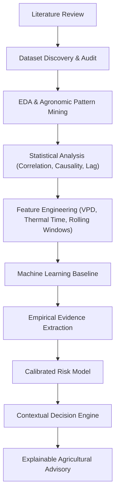

# TaniAdapt — Hyperlocal Precision Agro-Advisory

> **Evidence-Based Agricultural Decision Support System for Indonesian Smallholders**  
> *Translating Microclimate, Phenology, and Agrometeorological Dynamics into Calibrated Agronomic Actions.*

---

## 📌 Executive Summary

**TaniAdapt** adalah riset dan pengembangan sistem pendukung keputusan (*decision-support system*) presisi hiperlokal untuk sektor pertanian di Indonesia. Berbeda dengan pendekatan konvensional yang kerap mengandalkan aturan ambang batas naif (*naive rule-based threshold*, misal: `rainfall > X mm → bahaya`), TaniAdapt mengusung metodologi **evidence-based machine learning & statistical modeling** yang mengintegrasikan literatur agrometeorologi, dinamika mikroklimat temporal, serta fenologi tanaman.

### Paradigma Rekomendasi
```text
[ Mikroklimat & Temporal ] + [ Crop & Growth Stage ] + [ Variabel Biofisik ]
                                   ↓
                            Risk Assessment
                                   ↓
                           Recommended Action
                                   ↓
                         Agronomic Explanation
```

---

## 🔬 Metodologi: Evidence-Based Pipeline

TaniAdapt dibangun melalui alur ilmiah yang ketat dari pembuktian data hingga ke mesin rekomendasi:



---

## 📊 Dimensi Data & Fitur

Sistem ini dirancang untuk memproses multivariat data berikut:

| Kategori | Fitur / Variabel |
|---|---|
| **Weather / Microclimate** | Temperatur udara ($T_{min}$, $T_{max}$, $T_{avg}$), Curah hujan / intensitas presipitasi, Kelembapan relatif (RH), Radiasi matahari, Kecepatan & arah angin |
| **Temporal Dynamics** | Weather history, lag features (1–14 hari), rolling window statistics (mean, sum, std, consecutive wet/dry days) |
| **Crop Biology** | Jenis tanaman, varietas, koefisien tanaman ($K_c$) |
| **Phenology** | Fase pertumbuhan (*growth stage*), akumulasi satuan panas / Growing Degree Days (GDD) |
| **Biophysical / Agrometeorological** | Kelembapan tanah (*soil moisture*), Vapor Pressure Deficit (VPD), Evapotranspirasi (ET₀/ETc), *Leaf Wetness Duration* (LWD) |
| **Target Outcome (TBD)** | *Crop Disease Incidence / Severity* ATAU *Yield Prediction / Loss Risk* *(diputuskan pada Phase 5)* |

---

## 🗺️ Research Roadmap & Current Status

Proyek saat ini berada di **PHASE 3 (Dataset Discovery)**:

- [x] **PHASE 0** — Definisi Masalah & Kebutuhan Agro-Advisory Hiperlokal
- [x] **PHASE 1** — Research Questions (RQ) & Perumusan Hipotesis
- [x] **PHASE 2** — Deep Literature Review (Epidemiologi Penyakit & Agroklimatologi)
- [x] **PHASE 3 — Dataset Discovery & Clean Acquisition** *(COMPLETED — DS01 to DS06)*
- [x] **PHASE 4 — Dataset Quality Audit** *(COMPLETED — 12-Dimension Audit, Figures, Reports)*
- [ ] **PHASE 5** — Crop + Outcome Selection (Finalisasi komoditas & fokus: Disease vs. Yield)
- [ ] **PHASE 6** — Exploratory Data Analysis (EDA) & Domain Verification
- [ ] **PHASE 7** — Statistical Analysis (Lag correlation, non-linear dependencies)
- [ ] **PHASE 8** — Domain-Informed Feature Engineering (VPD, GDD, cumulative indices)
- [ ] **PHASE 9** — ML Baseline & Evaluation Framework
- [ ] **PHASE 10** — Evidence Extraction → Calibrated Risk Model
- [ ] **PHASE 11** — Risk Model → Decision Engine Architecture
- [ ] **PHASE 12** — Agronomic & Empirical Validation
- [ ] **PHASE 13** — TaniAdapt Decision-Support Application Deployment

---

## 📂 Struktur Repositori & Deliverables Phase 3 & 4

```text
research_taniAdapt/
├── README.md                                # Dokumentasi utama proyek & status riset
├── data/
│   └── raw/
│       ├── DS01_agera5/                     # AgERA5 Time-Series 2015-2024 (7 Lokasi Jabar, 24 Variabel)
│       ├── DS02_bangladesh_rice_panel/      # Replication archive BRRI (Stata14 + CSVs)
│       ├── DS03_west_java_rice_productivity/# Produktivitas Padi Jabar (Total, Sawah, Ladang)
│       ├── DS04_indonesia_agroclimatic/     # 18 file Parquet/CSV Open-Meteo/ERA5 (612 grid points)
│       ├── DS05_subang_maize_productivity/  # Produktivitas Jagung Jabar 2015-2022 (incl. Subang)
│       └── DS06_west_java_horticulture/     # Produktivitas SBS (Cabai Besar & Cabai Rawit) + Produksi
├── notebook/                                # Notebook Alur Kerja Utama Phase 3 & Phase 4
│   ├── 01_AgERA5.ipynb                      # DS01: AgERA5 7 Lokasi Jabar 2015-2024 (24 Variabel)
│   ├── 02_bangladesh_rice_panel.ipynb       # DS02: Panel Beras 64 Distrik Bangladesh (Benchmark)
│   ├── 03_west_java_rice_productivity.ipynb # DS03: Padi Jabar 27 Kab/Kota (Total, Sawah, Ladang)
│   ├── 04_indonesia_agroclimatic.ipynb      # DS04: 612 Grid Agroklimat Nasional (Indikator Ekstrem)
│   ├── 05_subang_maize_productivity.ipynb   # DS05: Jagung Jabar 2015-2022 (Fokus Kab. Subang)
│   └── 06_west_java_horticulture_productivity.ipynb # DS06: Hortikultura SBS Cabai Besar & Rawit


├── reports/
│   ├── dataset_discovery/
│   │   ├── dataset_catalog.csv              # Katalog komprehensif 6 dataset
│   │   ├── dataset_sources.json             # Metadata sumber resmi
│   │   ├── dataset_acquisition_manifest.csv # Manifest akuisisi lengkap (file, size, sha256)
│   │   ├── agera5_variable_inventory.csv    # 27 variabel AgERA5 resmi & parameter API
│   │   ├── variable_inventory_by_dataset.csv# 51 variabel terpetakan ke 7 kelompok TaniAdapt
│   │   ├── agera5_clean_start_note.md       # Dokumentasi arsitektur clean-start AgERA5
│   │   └── download_log.txt                 # Log proses akuisisi
│   └── dataset_audit/
│       ├── dataset_audit_summary.csv        # Tabel ringkasan 12 dimensi audit
│       ├── dataset_audit_dashboard.xlsx     # Workbook Excel konsolidasi multi-sheet
│       ├── audit_artifact_manifest.csv      # Manifest 27 artifak hasil audit
│       ├── index.html                       # Dashboard visual laporan audit statis
│       ├── 01_audit_agera5.md               # Laporan audit mendalam AgERA5
│       ├── 02_audit_bangladesh_rice_panel.md# Laporan audit mendalam Bangladesh Rice
│       ├── 03_audit_west_java_rice_productivity.md
│       ├── 04_audit_indonesia_agroclimatic.md
│       ├── 05_audit_subang_maize_productivity.md
│       ├── 06_audit_west_java_horticulture_productivity.md
│       └── figures/                         # Visualisasi diagnostik audit (PNG)
│           ├── ds01_agera5_plausibility.png
│           ├── ds02_rice_panel_missingness.png
│           ├── ds03_rice_coverage.png
│           ├── ds04_agroclimate_grid_map.png
│           ├── ds05_maize_coverage.png
│           └── ds06_chili_commodities.png
└── scripts/                                 # Skrip otomasi akuisisi dan audit yang dapat diulang
```

---

## 🚀 Panduan Eksekusi Notebook (`notebook/`)

Seluruh 6 notebook di folder `notebook/` telah diselaraskan dengan 6 dataset in-scope, dilengkapi **Visualisasi Multi-Panel** dan **Executive Audit Scorecard**:

1. **`01_AgERA5.ipynb`** — *DS01 Primary Weather Backbone*: Validasi 24 variabel cuaca harian (2015–2024) di 7 lokasi Jabar, uji hukum fisika atmosfer, grafik suhu Bandung 2024, serta komparasi curah hujan tahunan 7 lokasi.
2. **`02_bangladesh_rice_panel.ipynb`** — *DS02 Rice Panel Benchmark*: Replikasi BRRI/Elsevier 64 distrik (2015–2024), uji keunikan kunci panel, stacked bar observasi per musim, dan boxplot variabilitas hasil panen (*yield* t/ha).
3. **`03_west_java_rice_productivity.ipynb`** — *DS03 Regional Rice Outcome*: Data resmi 27 Kab/Kota (2015–2020), matriks lengkap 162 baris Padi Total, Sawah, dan Ladang, grafik tren rata-rata, serta disparitas produktivitas sawah vs ladang.
4. **`04_indonesia_agroclimatic.ipynb`** — *DS04 Extreme Indicators Reference*: 612 grid points nasional (14 titik Jabar), kamus 12 indikator agroklimat ekstrem (CDD, CWD, GDD), dan peta sebaran spasial Indonesia.
5. **`05_subang_maize_productivity.ipynb`** — *DS05 Regional Maize Outcome*: Data jagung 27 Kab/Kota (2015–2022), isolasi runtun waktu Kabupaten Subang, komparasi tren Subang vs Jawa Barat, dan ranking Top-5 sentra jagung Jabar 2022.
6. **`06_west_java_horticulture_productivity.ipynb`** — *DS06 Regional Horticulture Outcome*: Tren Cabai Rawit & Cabai Besar (2017–2024), komparasi produktivitas tahunan, dan **Audit Kritis Target Outcome** (konfirmasi bahwa data ini adalah statistik hasil panen, BUKAN label penyakit tanaman).

### Cara Menjalankan:
Buka file notebook di VS Code / Jupyter Lab, pilih kernel Python (`Python 3.11.x`), lalu klik **Run All**. Kode bersifat *idempotent* (langsung membaca data lokal dari `data/raw/` tanpa re-download) dan otomatis menyimpan grafik ke `reports/dataset_audit/figures/`.

---

## 🎯 Target Akhir Sistem

1. **Precision Risk Scoring:** Penilaian probabilitas risiko berbasis model empiris, bukan aturan kaku statis.
2. **Context-Aware Advisory:** Rekomendasi aksi agronomi (irigasi adaptif, aplikasi preventif, penyesuaian jadwal tanam/panen) disesuaikan dengan fase fenologi tanaman.
3. **Interpretability & Trust:** Memberikan justifikasi agronomis (*why this recommendation was given*) agar dapat dipercaya dan dipahami oleh petani maupun penyuluh pertanian lapangan.

